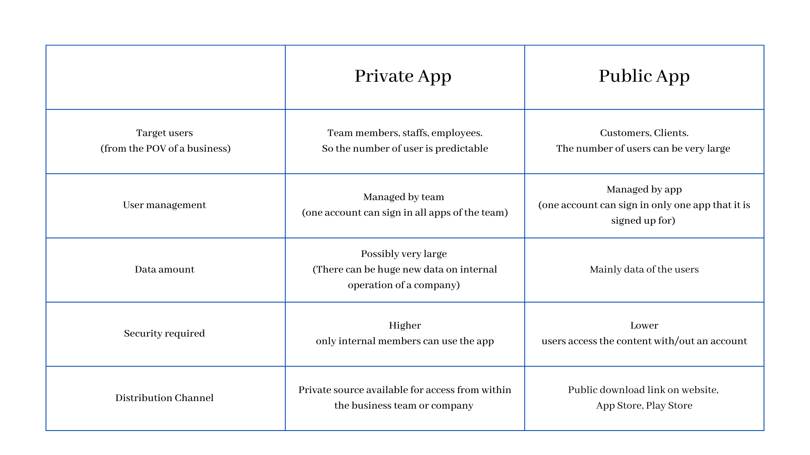

# App Types
## Summary
In this article, we introduce you the types of app that Starion can support you to build as well as provide the comparison between two of them. After reading the article, you can decide which type of app is suitable for your project.
## Detailed Overview
### Definition
 When we talk about the use of data, we divide them into two categories: data only for internal operation (private within the business), and data shown to the customers (public to everyone).

Starion supports the non-code developers to build two types of app suitable for each usage. They are called *Internal App* and *External App*

- *Private App* is for internal operation. It can be an optimal solution to the digital transformation of a business, therefore increasing the performance and productivity. 
- *Public App* is for external side of business operation: to communicate and deliver service to the customers. The app may not be the core product of the business, but it can attribute more value to the core products and services.
  

### Choose suitable type
From the definition above, you can see some differences in the usage and target users of each app type. Below we prepare a comparison table for the two types. This can help you determine which one is good enough for your business.
  

These differences also result to the difference in the pricing model we built for each type, so the cost charged on your team, organization, or company can be optimized at most.