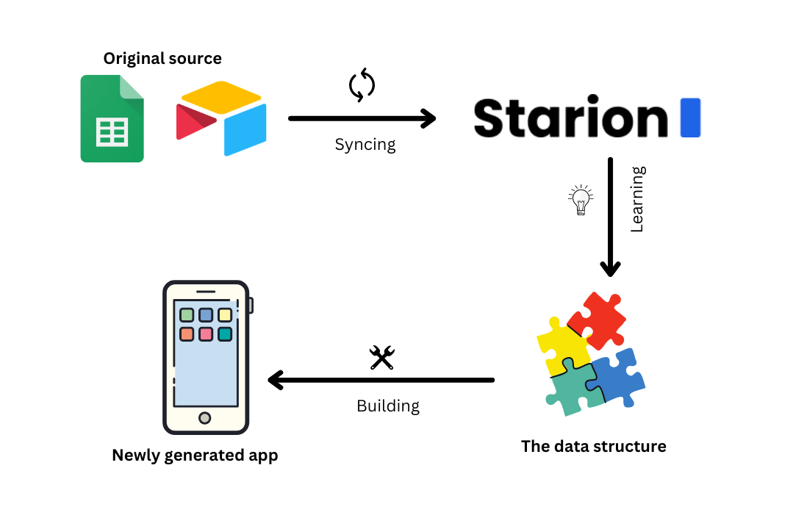

# Data source
## Summary
This article is about all of the data source management you can do in Starion. You also can find the instruction on how to set up the synchronization between your original data table and Starion, so you can easily build up your database in Starion and start building your own app.

## Detailed Overview

In Starion, data is the core element that you must have to build an app. Starion learns the way you organize your table and, based on that, generate the app for you.

We understand that bringing your data table around is really an annoying thing, and it may be the cause of the data mess-up. Therefore, Starion allows you to set up the direct synchronization. We support the work on 2 online platforms: *Google Sheets* and *Airtable*.

  

