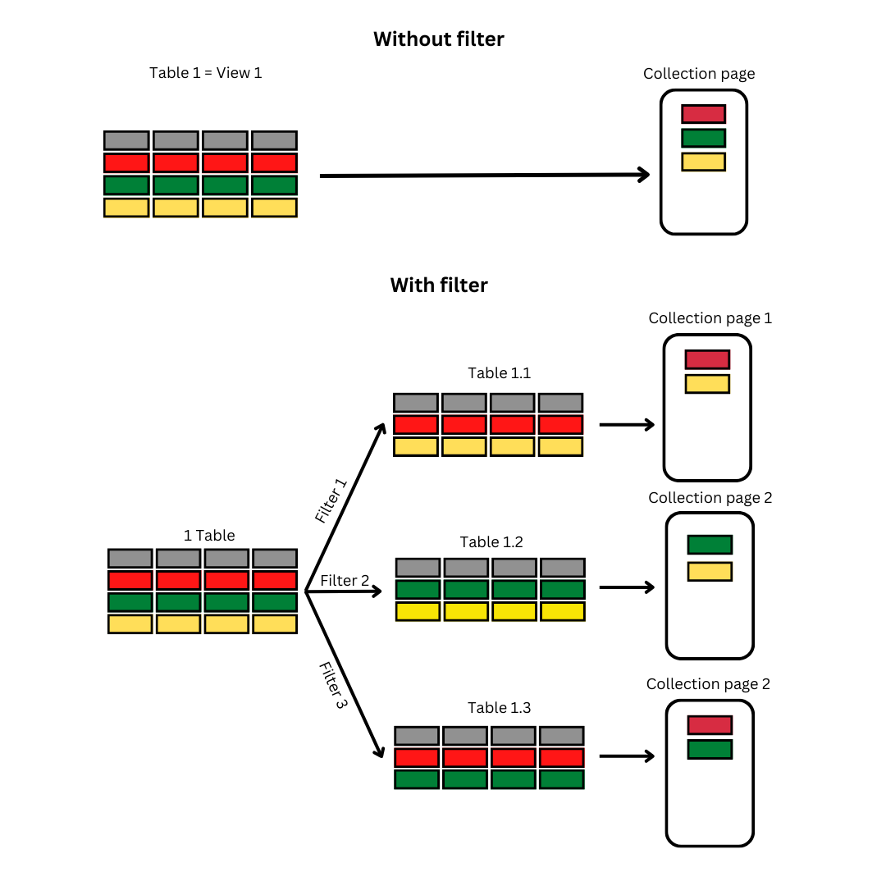

# Filter
## Summary
This is about the concept *Filtering* and the function *Filter* in Starion.

Going through this article, you can understand the work of *Filtering* and the reason why *Filter* is a powerful feature. 

There are two types of filtering in Starion, we provide the comparison in this article as well. Based on the comparison, you can find which one is more suitable for your work.

## Feature Overview
### How it works
In the [App Building Briefing](../../../core-concepts/app%20building%20briefing), we all got a point that *each collection page takes a table as its data source and generate a view equivalently*. 

However, with the help of *Filter*, you can modify several views on the table, and then generate them to several collection pages. 

  

Comparing with the work with no Filter tool, there are a lot of benefits you can get:
- No need to divide data into several tables
- No need to sync several tables just for one app
- Even possibility to generate several apps with one data source.
- (Therefore) Cost-saving, since the fee is charged based on the number of synced rows
### Types
As mentioned in the Summary, there are two types of Filter:
- Tool Filter allows you to create filters by choosing components directly on the App Editor's interface. It is good enough when you use simple filters.
- Formula Filter allows you to write a formula to filter your data. If you use complicated filters, you should choose this type.

## See Also
Related articles that you might want to read
- [Use Tool Filter](UI%20Filter)
- [Use Formula Filter](Formula%20Filter)
- [Formula](../../../core-concepts/formula.md)