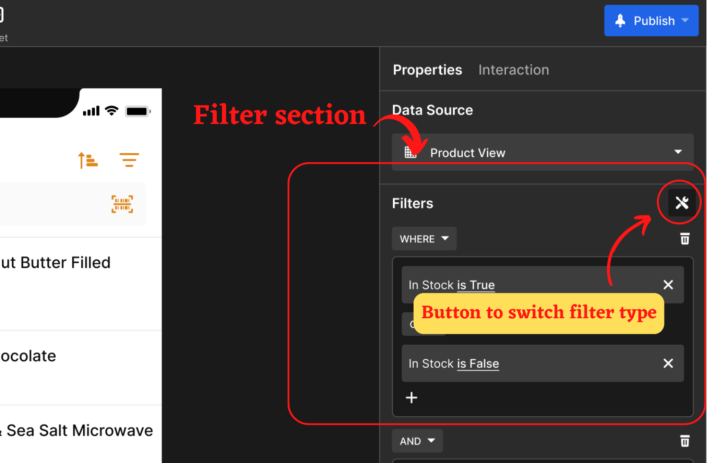
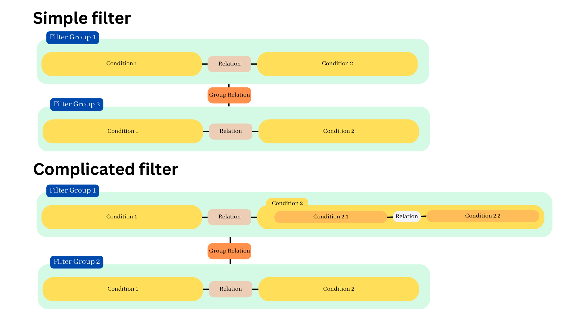

#Filtering
## Concept
Remember your work with data table, you have a general table. But you cannot always entire table to everyone. Working with different subjects requires you to prepare different tables for the suitable wanted data. In the end, you may have to manage unlimited number of tables or files.

Basically, in Starion, each of your imported data source is represented in one table, while one table can generate one view on the Collection page. So, the question you may have is that: *What is the difference of using Starion in the comparison with your normal work on other platforms like Excel, Google Sheet, or Airtable?*

It's that instead of letting you create new tables, Starion allows you to create several collection pages with different views just using 1 table only. We will make this point clearer: with the same columns & rows, you can vary several views for people to see at once. The dull data table now, in addition, becomes a page with more intuitiveness.

## Filter Type
You can find *Filter* on the right side bar of the App Editor when working on the collection page. 

The *Filter* is supported in two types: **Tool Filter** and **Formula Filter**. You can switch between 2 options of filter by clicking on the icon which is on the top right corner of the Filter section.

  

**Which type is suitable?**
* The *Tool Filter* is good enough for the basic use. It is fitting when your filter is combined by simple filters.
* The *Formula Filter* is the more optimal solution in case your filter includes more complicated filters or/and some additional calculation (?).
  
  
