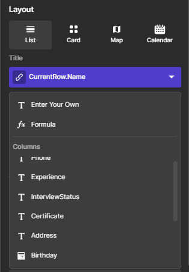

# Layout
## Concept
Normally, the work of design an layout includes so many things. You should take care about the elements and several principles for the best practice of layout design such as alignment, visual hierarchy, contrast and balance.

However, in Starion, it is simplified since all designing job has been completed. All concerns are taken care: *which font to use, the size of each elements for a bright view, or interactive elements like action buttons or dragging menu, and so on*. When there are changes made, things will be automatically adjusted while still in the balance and fits the frame well.

You can ensure that every detail of the interface is on set for the best practice of UI design (User Interface). You don't need to be an UI expert and you still can build pages with high effect for the good user experience.  The only thing you should be concerned are   - The type of layout you would prefer, and  - The content.  

**In Briefing**, by actions to click & choose, you describe your idea of page layout & content, and Starion will build up the page for you.

## Type of layouts
We provide you with 4 options of layouts: List Layout, Card Layout, Map Layout, and Calendar Layout. 

* **List Layout** can be found in several popular apps as the examples for actual practice such as Gmail or how Spotify shows songs of a playlist or an album.
    

* **Card Layout** turns your monotonic table view into a gallery. Pinterest can be the most straightforward example for the application of the Card layout.
    

* **Map Layout** represents the items in an address list and show them as pins of location on a map. This is the layout that some big company like Apple guide their customers the way to find the nearest stores in the nearby.
    

* **Calendar Layout** organizes your items into a Calendar, each item is an event. The layout make the view more intitutive when you manage your items by timeline.
      

There can be more than just 4 layouts. However, when we condensed them all, these layout are the most basic. They are applied by (almost) any apps you can think about, and fit all the way you want to organize your items.

## Content

To fill the content into the layout, there are 3 ways for you
* ***Enter a value***: use this when you want the content to be fixed for all case.
* ***Choose a column* of data in your table**: Use this in case the content varies in each case, and the data is available in your data table.
* ***Use Formula* to get the wanted value** : Use this if the content varies in each case, and the wanted data should go through some more filter or calculation.

  
