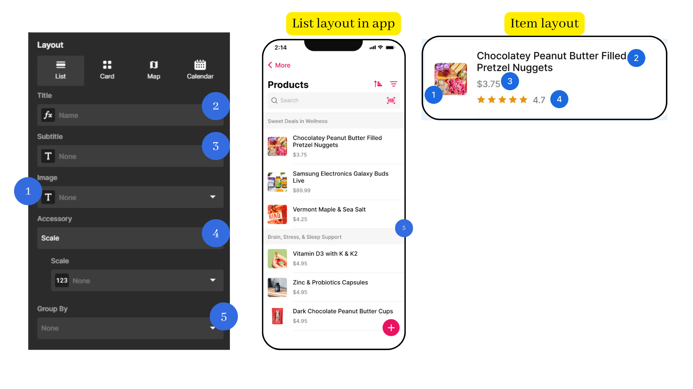

## List Layout
This is to help you working with the List layout settings-up for your Collection page.
See the picture below to see how each setting works on the overall layout and each item layout.
  

**Properties Detail**

1. **Image**
   Required: No
   Data type: Text (URL)
   Image Ratio: 1:1
 
1. **Title**
   Required: Yes
   Data type: Text
   Limited Line: 2
 
1. **Subtitle**
   Required: No
   Data type: Text
   Limited Line: 2
 
1. **Accessory**
   Required: No
   Data type: 
 
5. **Group By**
   